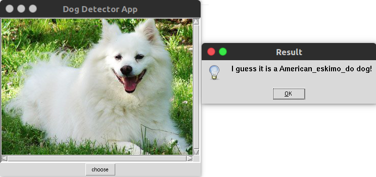

# Dog Recognition

应用机器学习算法对小狗图像进行识别。

给定一个狗的图像，算法将会识别并估计狗的品种，如果提供的图像是人或其它物体，代码将会识别最相近的狗的品种。

  

# Quick Start

运行脚本文件, 完成模型训练并生成犬类图像识别GUI：可以自定义图像进行识别。  
获取权限：chmod + x run_all.sh  
运行： ./run_all.sh  

# Solution

## About the Data

1. Download the [dog dataset](https://s3-us-west-1.amazonaws.com/udacity-aind/dog-project/dogImages.zip). Unzip the folder and place it in the repo, at location `path to/data/dogImages`.
2. Download the [human dataset](https://s3-us-west-1.amazonaws.com/udacity-aind/dog-project/lfw.zip). Unzip the folder and place it in the repo, at location `path to/data/lfw`. If you are using a Windows machine, you are encouraged to use [7zip](http://www.7-zip.org/) to extract the folder.
3. Donwload the [InceptionV3 bottleneck features](https://s3-us-west-1.amazonaws.com/udacity-aind/dog-project/DogInceptionV3Data.npz) for the dog dataset. Place it in the repo, at location `path to/model/bottleneck_features`.

## About GUI

基于Tkinter实现APP GUI，详见代码05_dog_app.py

## Architecture

### 犬类识别

#### 图像增强

在实际使用中，对用户提供含清晰面部特征的人脸图像，要求较高，但这是合理的。因为在人脸识别过程中，会受到光照、拍摄角度、遮挡等多种因素的干扰，如果不能保证图像清晰，则会大大降低准确率。
如果实在无法获得清晰图像，即当图像中没有清晰的面部特征，无法识别出五官等特征时，可以尝试采[用图像增强](https://blog.keras.io/building-powerful-image-classification-models-using-very-little-data.html)方式。

#### 模型

主要用的模型为[MobileNetV2](https://arxiv.org/abs/1801.04381)模型，最终生成的模型约为20M。

### 人脸识别

#### 使用opencv进行人脸识别

  使用预训练模型haarcascade_frontalface_alt.xml
  // TODO： 补充说明文档

#### 构建深度学习模型进行人脸识别

  // TODO:

